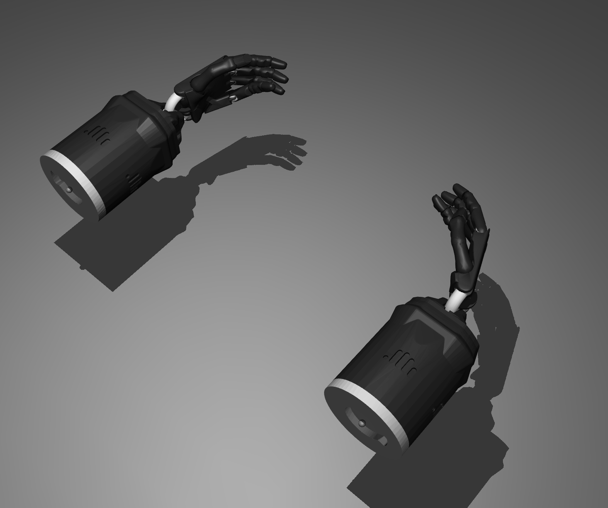

# Surgical_Robotics_hands
Robotics hand simulation for surgical robotics

Standalone dexterous robotic hand simulation in MuJoCo for surgical robotics research. Built to evaluate fine contact dynamics, tendon actuation, and micro-grasping of surgical instruments (e.g., suture needles).

---


---

## Prerequisites

### Ubuntu / Debian Host Setup
If running directly on Linux without Docker, ensure Python 3, `pip`, and `venv` are installed on your host system:

```bash
sudo apt update
sudo apt install -y python3-pip python3-venv

# Create and activate virtual environment
python3 -m venv venv
source venv/bin/activate

# Install requirements
pip install -r package_requirements.txt

# Export repository path to PYTHONPATH
export PYTHONPATH=$PYTHONPATH:$(pwd)

# Running the demo
cd demo_two_hand_wave
python run_mjsim.py --gui
```

## Maintenance & License
[!WARNING]

**NOTICE:** This repository is provided as-is for educational and research purposes. It is **unmaintained**, and the maintainers assume no responsibility for updates, issue support, or future distributions.

This project is licensed under the [MIT License](LICENSE).
